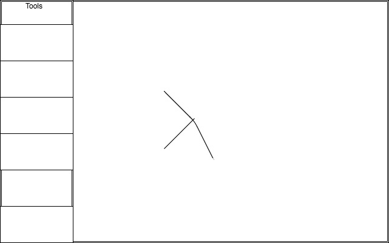

# VisChemJS

## Background

Molecular structure and shape are very important concepts in organic chemistry. This project aims to give the user all the tools necessary to draw organic molecules from the most simple carbon-carbon bonds to complex biomolecules with varying chemical shapes and moieties. Similar tools are commonly utilized both in learning organic chemistry and even in drawing molecules for publications in journals or other original chemical research. VisChemJS will not simply be a blank canvas to draw molecules, but it will also be aware of common chemical bonding behaviors and the associated changes in charge that come along with having more or less bonds than a particular atom usually prefers.

## Functionality and MVPs

VisChemJS will give the user all the tools necessary to reach the following Minimum viable product features:

- [ ] Draw simple carbon-carbon bonds from single to triple bonds
- [ ] Attach common organic chemistry functional groups not based on carbon
- [ ] Automatically update charge when a chemical has more or less bonds than oxidation state prefers
- [ ] Choose between a set of pre-made functional groups to speed up drawing more complicated structures

Additionally, this app will contain the following:

- [ ] A production Readme
- [ ] An About modal describing the background, use, and functionality of VisChemJS.

### Wireframes

This app will consist of a single viewing window in which users will alter a chemical scaffold to create whatever molecules they wish.

### Architecture and Technologies

The following technologies will be involved in the implementation of VisChemJS:

- Vanilla JavaScript and jQuery for structure and chemical properties,
- Easel.js with HTML5 Canvas for rendering of structures and DOM manipulation,
- Webpack for script bundling.

In addition to the webpack entry file, there will be at least three scripts involved:

`structure.js`: this script will handle logic for creating and updating chemical structures with `Easel.js` elements and rendering them to the DOM.

`bonding.js`: this script will handle the logic that ultimately will guide users toward producing valid chemical structures based on bonding rules.  This script will enforce the rules as to how many bonds a specific atom can have  It will be responsible for checking each adjacent atom and updating the molecular charge according to how many bonds are associated with a single atom.

`atom.js`: This will hold the individual information of each specific atom such as oxidation state and the number of chemical bonds/lone pair electrons available.

### Implementation Timeline

**Day 1**: Setup all necessary Node modules, including getting webpack up and running and `Easel.js` installed.  Create `webpack.config.js` as well as `package.json`.  Write a basic entry file and the bare bones of all 3 scripts outlined above.  Learn the basics of `Easel.js`.  Goals for the day:

- Get a working webpack bundle
- Use Easel.js in order to start rendering molecules
- Learn Easel.js API.

**Day 2**: Build the atom object in order to make individual atoms  Then, use bonding.js to create and render chemical bonds between atoms. Goals for the day include:

- Complete `atom.js`
- Render a basic molecule using `Easel.js`
- Make molecules and atoms draggable
- Make molecules and atoms bondable

**Day 3**: Build the logic in bonding.js that will update the charge of a molecule upon having more than the preferred number of bonds.  Goals for the day:

- Have a functional grid molecule that will alternate charge based on the number of bonds attached to it.

**Day 4**: Add some default chemical functional groups to speed up production. Style the frontend to a professional degree. Goals for the day:

- Have buttons for common chemical moieties/functional groups.
- Style the frontend

### Bonus features

Possible updates to VisChemJS include but are not limited to:

- [ ] Add algorithm that can convert a chemical structure to a probable naming convention
- [ ] Add biochemical / protein-building capabilities
- [ ] Add ability to predict NMR structure from chemical structure (Very Difficult)
